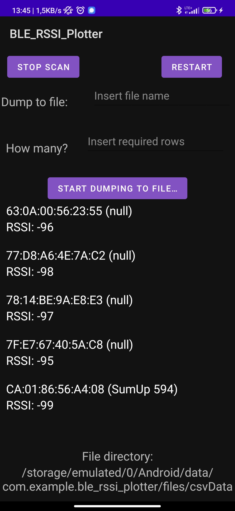
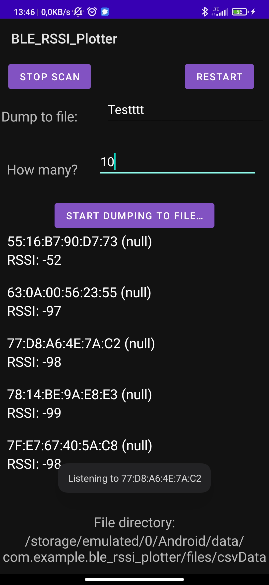
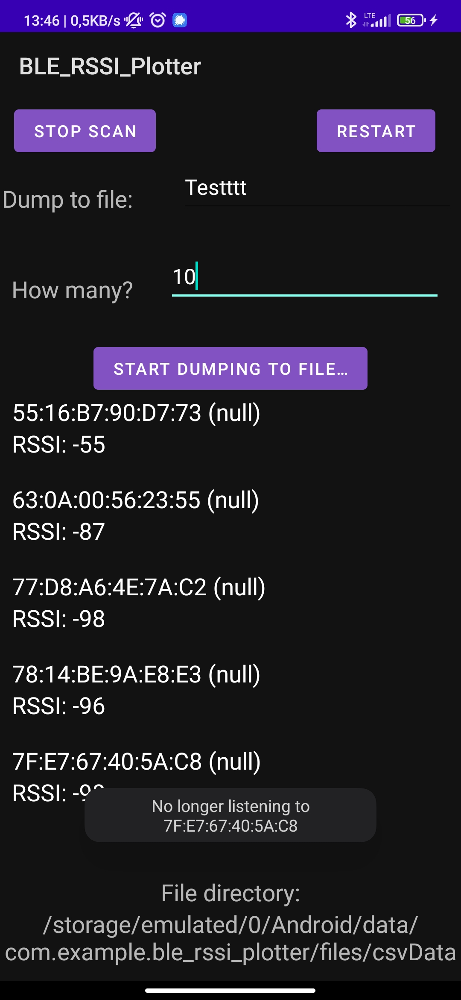
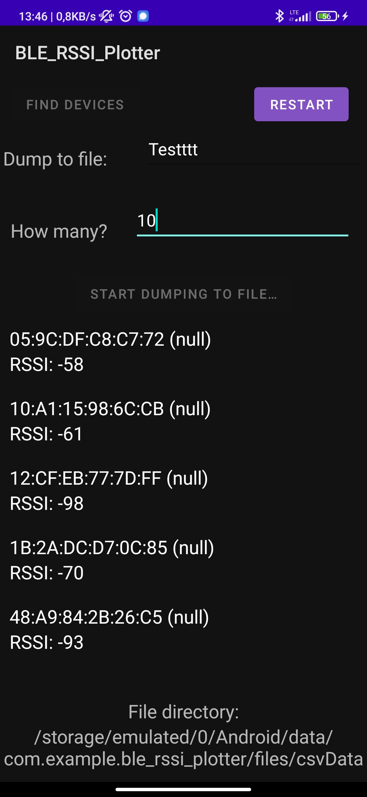
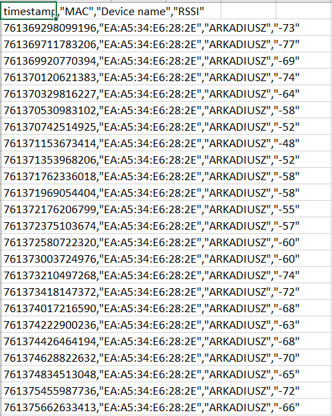

# Android-BLE-RSSI-Logger
### Student project for sake of telecommunication lectures

## Description
Allows to scan and dump selected (by clicking) Bluetooth devices to .csv file with details.

timestamp | MAC | Device name | RSSI
------------ | ------------- | ------------- | -------------
761369298099196 | EA:A5:34:E6:28:2E | ARKADIUSZ | -73

## images
 |  | 

 |  | 

### For more details check images/ folder.
